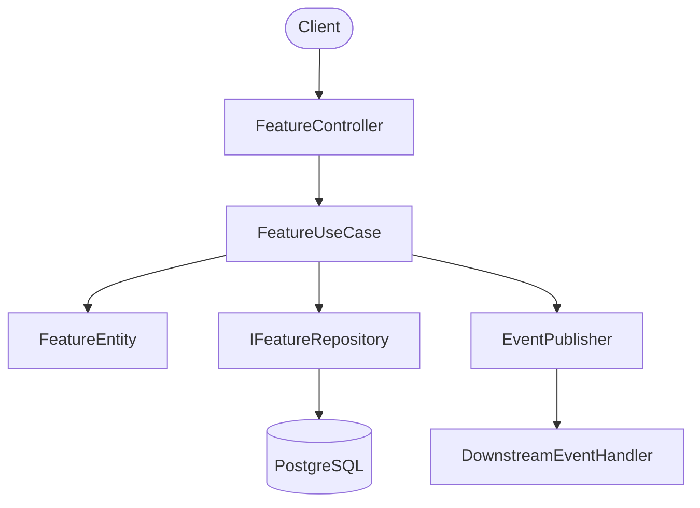
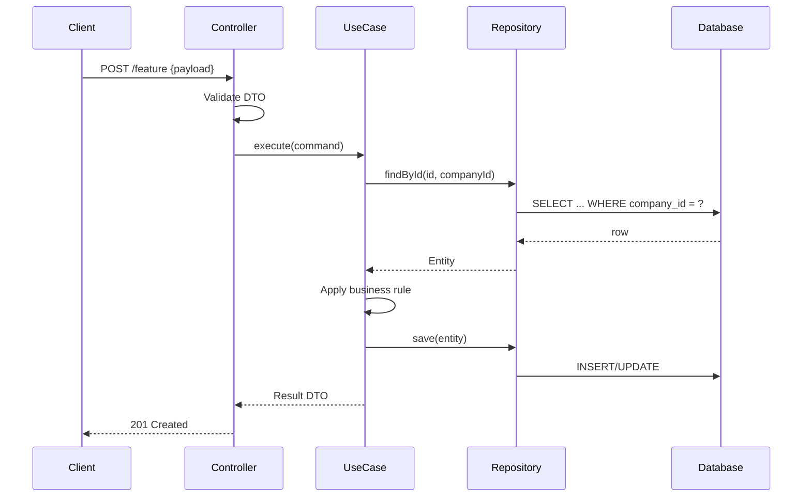

# Workflow: Architecture Design

This workflow produces the technical design document that implementation follows. It runs after requirements are confirmed and before any code is written.

## When to Use

- A confirmed requirements document exists (`docs/requirements/<feature>.md`)
- The feature introduces new components, APIs, database tables, or cross-module interactions
- An architectural decision needs to be recorded (ADR)
- Existing design needs revision before re-implementation

## Step 1 — Context Load (MANDATORY)

```bash
coder skill resolve "architecture <domain or feature>" --trigger initial --budget 3
coder memory search "<feature name or component>"
```

Also read:
- `docs/requirements/<feature>.md` — confirmed requirements
- `docs/design/` — existing design documents for the system
- Relevant source files: existing modules, entity definitions, repository interfaces

When requirements or constraints sharpen the scope, re-run:

```bash
coder skill resolve "architecture <clarified domain or feature>" --trigger clarified --budget 3
```

## Step 2 — Analyze Existing Architecture

Before designing, understand what already exists:

1. Map the current Clean Architecture layers in this module:
   - Presentation: controllers, handlers, resolvers
   - Application: use cases, services, DTOs
   - Domain: entities, value objects, domain interfaces, exceptions
   - Infrastructure: repositories, external API clients, DB adapters

2. Identify reuse opportunities: existing entities, DTOs, repositories, events

3. Identify integration points: which existing modules does this feature interact with? (event-driven only — no direct cross-module repository calls)

## Step 3 — Produce Design Document

**Output path**: `docs/design/<feature-name>.md`

```markdown
# Design: <Feature Name>

**Date**: YYYY-MM-DD
**Status**: Draft | Confirmed
**Requirements**: [docs/requirements/<feature>.md](../requirements/<feature>.md)

---

## Architecture Overview

<2-3 paragraph narrative: what this feature does technically, how it fits into the existing system, and what the key design decisions are>

## Component Diagram



## Data Flow



## API Contract

### Endpoints

| Method | Path | Auth | Description |
|--------|------|------|-------------|
| POST | `/api/v1/<resource>` | Bearer JWT | Create |
| GET | `/api/v1/<resource>/:id` | Bearer JWT | Get by ID |
| PATCH | `/api/v1/<resource>/:id` | Bearer JWT | Update |
| DELETE | `/api/v1/<resource>/:id` | Bearer JWT | Delete |

### Request DTO

```typescript
// CreateFeatureDto
{
  name: string;           // required, max 255
  companyId: string;      // from JWT, not in body
}
```

### Response DTO

```typescript
// FeatureResponseDto
{
  id: string;
  name: string;
  createdAt: string;      // ISO 8601
}
```

### Error Responses

| Code | HTTP | Scenario |
|------|------|----------|
| `VAL_*` | 400 | Invalid input |
| `AUTH_UNAUTHORIZED` | 401 | Missing or invalid token |
| `BIZ_NOT_FOUND` | 404 | Resource not found |
| `INF_DATABASE_ERROR` | 500 | Persistence failure |

## Database Schema

```sql
CREATE TABLE features (
    id          UUID PRIMARY KEY DEFAULT gen_random_uuid(),
    company_id  UUID NOT NULL,
    name        VARCHAR(255) NOT NULL,
    created_at  TIMESTAMPTZ NOT NULL DEFAULT NOW(),
    updated_at  TIMESTAMPTZ NOT NULL DEFAULT NOW()
);

CREATE INDEX idx_features_company_id ON features(company_id);
```

**Migration file**: `migrations/XXX_create_features_table.sql`

## Domain Events

| Event | Trigger | Consumer |
|-------|---------|----------|
| `FeatureCreated` | After save in CreateUseCase | Notification module (async) |

## Security Considerations

- `company_id` extracted from JWT — never accepted from request body
- All repository queries include `company_id` filter
- Input validation via DTO class-validators before reaching use case
- No PII stored in this module

## Error Handling Strategy

- Validation errors thrown as `VAL_*` in DTO layer
- Business rule violations thrown as `BIZ_*` in use case layer
- Infrastructure failures caught and re-thrown as `INF_*` in repository layer
- Domain exceptions never expose internal stack traces

## ADR — Architecture Decision Record

### ADR-001: <Decision Title>

**Status**: Accepted

**Context**: <Why was this decision needed? What forces were at play?>

**Decision**: <What was decided?>

**Consequences**: <What are the trade-offs? What becomes easier or harder?>

**Alternatives Considered**:
- Option A: <description> — rejected because <reason>
- Option B: <description> — rejected because <reason>
```

## Step 4 — Review Against Principles

Before finalizing, verify:

- [ ] Dependencies point inward only (no domain → infrastructure imports)
- [ ] Domain layer has zero framework imports
- [ ] Cross-module communication via events only — no direct repository imports from other modules
- [ ] Every query includes `company_id` filter
- [ ] All error paths use standardized error codes
- [ ] Events published AFTER transaction commits, not before
- [ ] Mermaid diagrams are accurate and complete

## Step 5 — Confirm

Present the design summary to the team:

> "Design for [Feature] is ready. Key decisions:
> - [Architecture choice and rationale]
> - [API contract summary]
> - [DB schema summary]
>
> Any concerns before implementation begins?"

Proceed to `implement-feature.md` only after confirmation.

## Step 6 — Gate Out (MANDATORY)

```bash
coder memory store "Design: <Feature Name>" "Architecture: <key decisions>. API: <endpoints>. DB: <tables>. Events: <events published>. ADR: <decisions recorded>." --tags "design,architecture,<feature>,<domain>"
```

---

## Checklist

- [ ] `coder skill resolve` run
- [ ] `coder memory search` run
- [ ] Requirements doc read and understood
- [ ] Existing architecture analyzed
- [ ] `docs/design/<feature>.md` written with all sections
- [ ] Mermaid diagrams included (component + sequence)
- [ ] API contract documented
- [ ] DB schema and migration plan documented
- [ ] ADR written for each non-obvious decision
- [ ] Clean Architecture compliance verified
- [ ] Design confirmed by team
- [ ] `coder memory store` run
