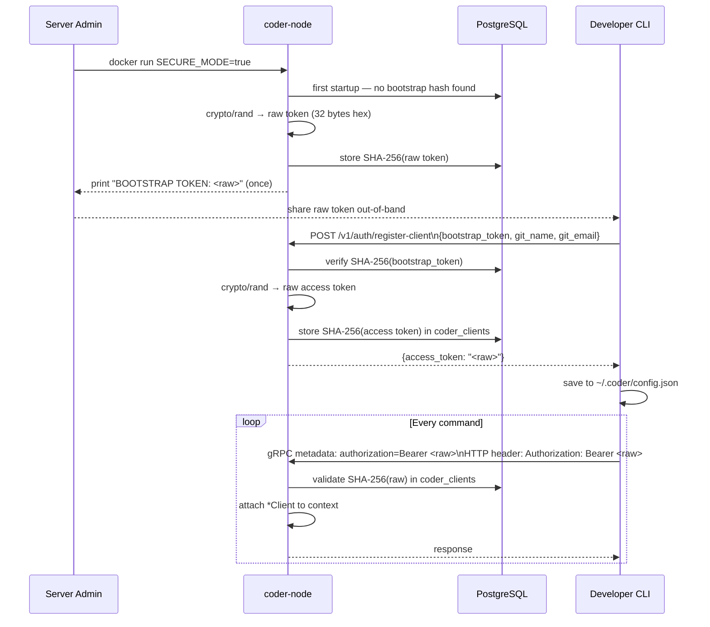
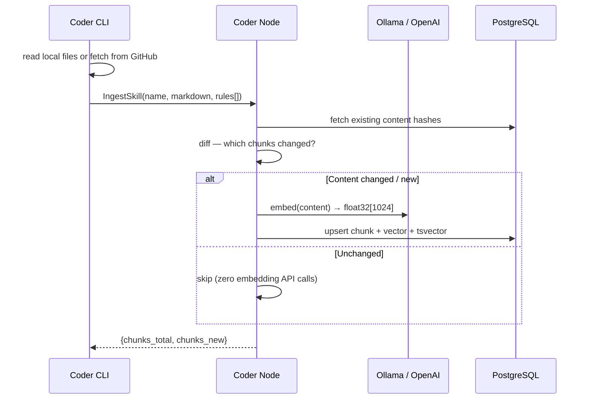
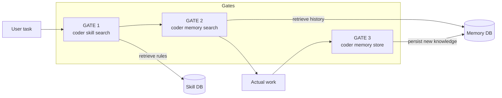

# System Architecture

---

## Overview

`coder` is a client-server system. The CLI is the thin front door for developers and AI agents; `coder-node` is the stateful backend that handles embeddings, vector search, and authentication.

```
  Developer / AI Agent
        │
        │  coder CLI  (single binary)
        │  ├─ coder skill search …
        │  ├─ coder memory search / store / verify / supersede / audit …
        │  └─ coder login / self-update / install …
        │
        │  Bearer token (gRPC metadata / HTTP header)
        ▼
  ┌─────────────────────────────────────┐
  │          coder-node (Docker)        │
  │                                     │
  │  ┌─────────────┐  ┌──────────────┐  │
  │  │  gRPC :50051│  │  HTTP :8080  │  │
  │  └──────┬──────┘  └──────┬───────┘  │
  │         │  Auth intercept│ors        │
  │         └────────┬───────┘           │
  │                  ▼                   │
  │  ┌───────────────────────────────┐   │
  │  │   Use-case layer              │   │
  │  │   SkillFacade · MemoryManager │   │
  │  │   AuthManager                 │   │
  │  └───────────────────────────────┘   │
  │                  │                   │
  │  ┌───────────────▼───────────────┐   │
  │  │   Infrastructure              │   │
  │  │   PostgreSQL + pgvector       │   │
  │  │   Ollama (local embeddings)   │   │
  │  └───────────────────────────────┘   │
  └─────────────────────────────────────┘
```

---

## Clean Architecture layers

```
cmd/coder          cmd/coder-node
      │                   │
      ▼                   ▼
internal/transport/{grpc,http}/{client,server,interceptor,middleware}
      │                   │
      ▼                   ▼
internal/usecase/{memory,skill,auth}
      │                   │
      ▼                   ▼
internal/domain/{memory,skill,auth}   ← zero framework dependencies
      ▲                   ▲
      │                   │
internal/infra/{postgres,embedding,github}
```

Dependencies point **inward only**. The domain layer knows nothing about gRPC, HTTP, or PostgreSQL.

---

## Authentication architecture

### Token lifecycle



### gRPC auth path

```
grpc.NewServer(
    grpc.ChainUnaryInterceptor(interceptor.UnaryAuth(authMgr)),
    grpc.ChainStreamInterceptor(interceptor.StreamAuth(authMgr)),
)
    │
    ▼
interceptor.validateToken(ctx)
    │  metadata.FromIncomingContext(ctx) → "authorization"
    │  strings.CutPrefix("Bearer ")
    │  authMgr.ValidateToken(ctx, raw)
    ▼
authdomain.WithClient(ctx, client)  →  handler(ctx, req)
```

Client side — `credential.BearerToken` implements `credentials.PerRPCCredentials`:
```go
grpc.WithPerRPCCredentials(credential.BearerToken{Token: accessToken})
// injects: authorization: Bearer <token>  on every RPC
```

### HTTP auth path

```
httpmiddleware.Auth(authMgr)(httpMux)
    │
    ▼
r.Header.Get("Authorization")  →  "Bearer <raw>"
authMgr.ValidateToken(ctx, raw)
authdomain.WithClient(r.Context(), client)
```

Public paths (never gated): `/health`, `/v1/auth/register-client`

---

## Hybrid search (RRF)

Every `skill search` and `memory search` runs two queries in parallel and fuses the rankings:

```
Query
  ├─ pgvector cosine similarity  →  semantic_rank
  └─ tsvector full-text search   →  keyword_rank
             │
             ▼
  rrf_score = 1/(60 + semantic_rank) + 1/(60 + keyword_rank)
             │
             ▼
  ORDER BY rrf_score DESC LIMIT n
```

Benefit: exact-match and short queries that confuse pure embedding search still rank correctly because of the full-text component.

---

## Data flow: skill ingestion



---

## Data flow: agent reasoning (3-Gate Loop)



1. **Skill retrieval** — "How should I approach this?" (architecture patterns, language idioms)
2. **Memory retrieval** — "What have we done here before?" (project decisions, past fixes, conflict-aware active truth)
3. **Knowledge capture** — "What did I learn?" (store, verify, or supersede so the next agent benefits without stale context)

---

## Component inventory

| Path | Responsibility |
|------|----------------|
| `cmd/coder` | CLI entry point, command handlers |
| `cmd/coder-node` | Server main: wire auth, gRPC, HTTP |
| `internal/domain/auth` | `Client`, `Activity` entities; `AuthManager` / `AuthRepository` interfaces; context helpers |
| `internal/domain/memory` | `Knowledge`, `MemoryManager`, `MemoryRepository` |
| `internal/domain/skill` | `Skill`, `SkillChunk`, `SkillUseCase`, `SkillClient` |
| `internal/usecase/auth` | Bootstrap token lifecycle, token validation, activity logging |
| `internal/usecase/memory` | Store, search (RRF), list, delete, compact, revector |
| `internal/usecase/skill` | Ingest (diff + embed), search (RRF), list, get, delete |
| `internal/infra/postgres` | Repository implementations (pgvector + tsvector) |
| `internal/infra/embedding` | Ollama + OpenAI embedding providers |
| `internal/infra/github` | GitHub API fetcher for remote skill ingestion |
| `internal/transport/grpc/server` | gRPC service handlers |
| `internal/transport/grpc/client` | gRPC client (memory + skill) |
| `internal/transport/grpc/interceptor` | `UnaryAuth`, `StreamAuth` server interceptors |
| `internal/transport/grpc/credential` | `BearerToken` PerRPCCredentials |
| `internal/transport/http/server` | HTTP REST handlers (memory, skill, auth) |
| `internal/transport/http/client` | HTTP client (memory + skill) |
| `internal/transport/http/middleware` | `Auth` middleware |
| `api/proto` | Protobuf definitions |
| `api/grpc/{memorypb,skillpb}` | Generated Go gRPC code |
