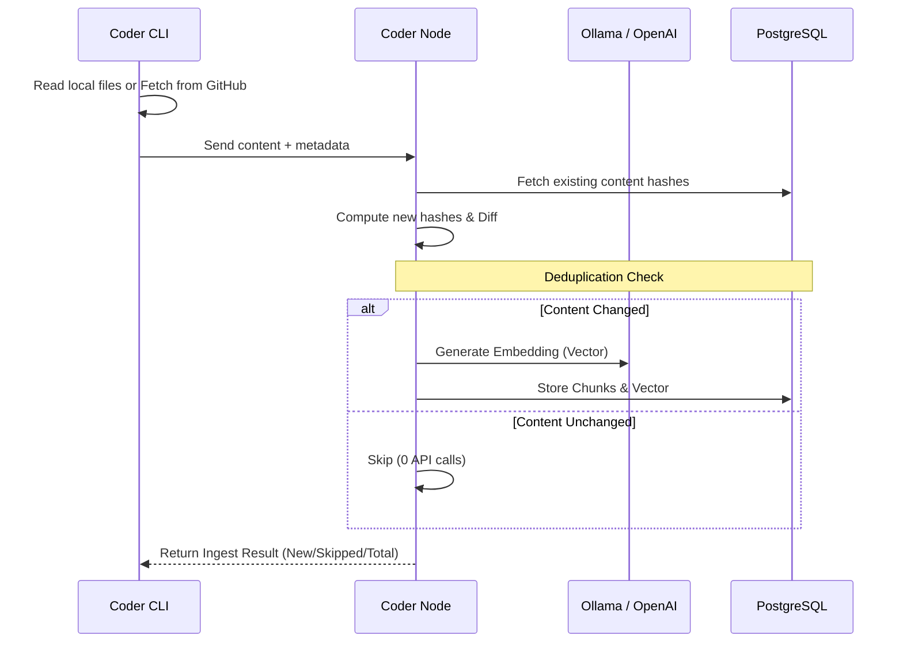
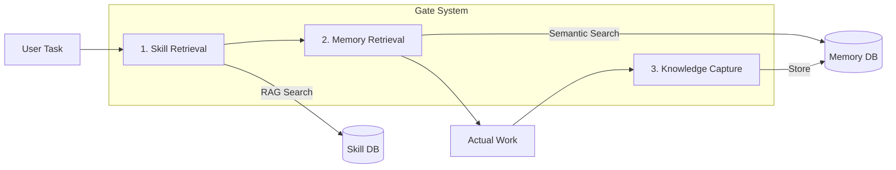

# 🏗️ System Architecture

This document describes the high-level architecture of the **coder** system, detailing the relationship between the CLI, the Node service, and the external AI ecosystems.

## 🌉 High-Level Overview

`coder` follows a client-server architecture where the CLI acts as the front door for developers and AI agents, while `coder-node` provides the heavy lifting for vector embeddings and persistence.

```mermaid
graph TD
    subgraph "External AI Suite"
        CP[GitHub Copilot]
        AG[Antigravity Agent]
    end

    subgraph "Local Project"
        MD[.agents/ manifest]
        SK[.agents/skills/]
        WF[.agents/workflows/]
    end

    subgraph "Coder CLI (Go)"
        CMD[Command Router]
        INST[Installer]
        GRPC[gRPC Client]
        HTTP[HTTP Client]
    end

    subgraph "Coder Node (Go Docker)"
        NODE[Service Orchestrator]
        ING[Skill Ingestor]
        MEM[Memory Manager]
    end

    subgraph "Infrastructure"
        PG[(PostgreSQL + pgvector)]
        OL[Ollama / OpenAI]
    end

    %% Interactions
    CP & AG -->|Reads| SK & WF
    MD -.->|Manages| SK & WF
    
    CMD --> INST
    INST -->|Writes| Local\ Project
    
    CMD --> GRPC & HTTP
    GRPC & HTTP -->|Protocol| NODE
    
    NODE --> ING & MEM
    ING & MEM -->|Embeddings| OL
    ING & MEM -->|Persistence| PG
```

---

## ⚙️ Core Components

### 1. Coder CLI (`cmd/coder`)
- **Distribution**: Single binary for Windows, Linux, and macOS.
- **Responsibility**:
    - **Installation**: Project-level distribution of skills, rules, and workflows.
    - **Self-Update**: Auto-upgrade mechanism via GitHub Releases.
    - **RAG Interface**: Gateway to the Skill and Memory vector databases.
- **Technology**: Built in Go using standard library and minimal dependencies for speed and cross-platform compatibility.

### 2. Coder Node (`cmd/coder-node`)
- **Distribution**: Dockerized microservice.
- **Responsibility**:
    - **Vectorization**: Interfacing with Ollama (local) or OpenAI to generate embeddings.
    - **Skill RAG**: Ingesting, chunking, and searching AI rules-of-engagement.
    - **Semantic Memory**: Storing and retrieving factual/contextual project data.
- **Protocols**: Dual-stack support (gRPC for performance, HTTP for compatibility).

### 3. Vector Knowledge Base (PostgreSQL)
- **Engine**: PostgreSQL with the `pgvector` extension.
- **Tables**:
    - `knowledge`: Stores semantic memory chunks.
    - `skills`: Metadata about ingested skill sets (source, version, repo).
    - `skill_chunks`: The actual vector embeddings of rules and instructions.

---

## 🏎️ Data Flow: Skill Ingestion (RAG)

When you run `coder skill ingest`, the system performs an intelligent synchronization:



---

## 🧠 Data Flow: Agent Reasoning (The 3-Gate Loop)

The system enforces a "Thinking Loop" for AI agents via [workflows](workflows.md), ensuring they always act with full context.



1. **Skill Gait**: Agent checks the vector DB for "How should I do this?" (e.g., NestJS error patterns).
2. **Memory Gait**: Agent checks the project history for "What have we done here before?".
3. **Knowledge Capture**: After completion, the agent stores the experience back into the system.
