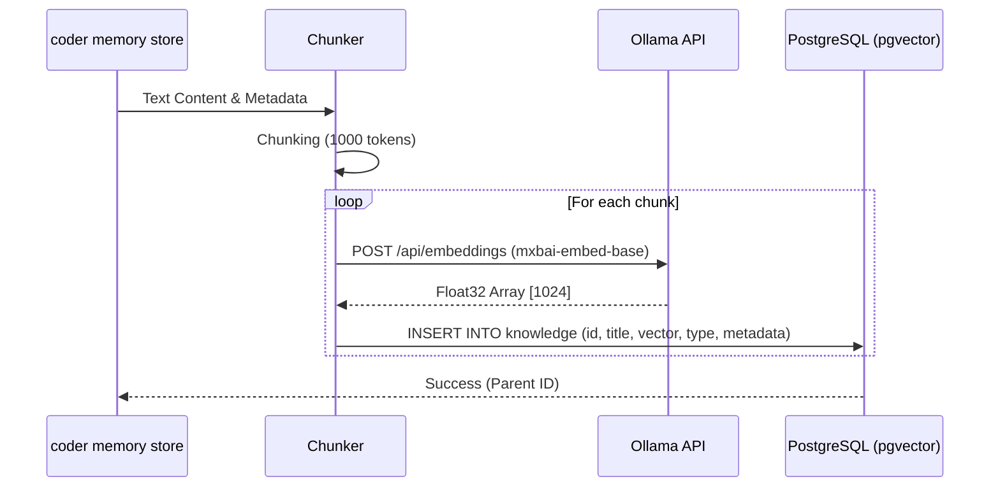
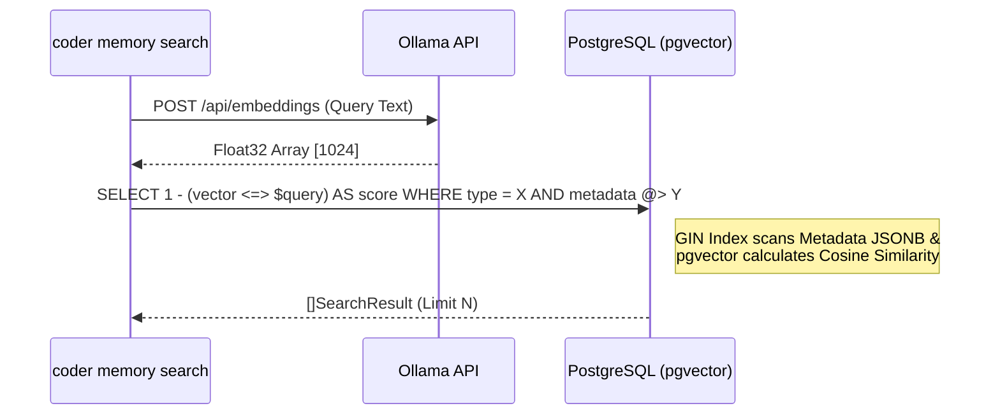

# Memory Architecture (coder)

The `memory` system of `coder` is a built-in Vector Database & Retrieval-Augmented Generation (RAG) designed as a **Cognitive Memory Framework**. Unlike traditional RAG libraries, `coder memory` focuses on multi-dimensional context, tailored specifically for autonomous AI Agents and automated Workflows.

## 1. Technology Stack

During its upgrade, the memory architecture transitioned from Local SQLite + OpenAI to a Professional On-Premise scale:

- **Storage Engine:** PostgreSQL
- **Vector Search Engine:** `pgvector` extension (Cosine similarity with `<=>` operator).
- **Embedding Provider:** Ollama (Local AI Container).
- **Embedding Model:** `mxbai-embed-base` (Standard vector dimension: 1024).

The system still retains a fallback module for SQLite & OpenAI if users do not set up an internal server, fully configurable via `~/.coder/config.json`.

## 2. Knowledge Model

A record (Knowledge) in the system is not just a plain text string but is defined through "Advanced Augmentation":

### Type (Memory Classification)
- **`fact`**: Objective truths (e.g., "The system is running on C++14").
- **`rule`**: Mandatory rules / Coding standards to follow.
- **`preference`**: User or Team habits/preferences (e.g., "Use Tabs instead of Spaces").
- **`skill`**: Execution steps/guides (Workflow manual).
- **`event`**: Version history logs or conversation logs.
- **`document`**: Traditional text documents (Default).

### Metadata (Ecological Identity)
Utilizing the `JSONB` field in PostgreSQL (`metadata`), this includes:
- **`entity_id`**: Identifies who or which Project this Memory belongs to (e.g., `glocal_source`).
- **`session_id`**: Memory lifecycle scope (Attached to a specific session, easily cleared when the session ends).
- **`process_id`**: Name of the Agent that created this memory (e.g., `qa-agent`, `dev-agent`).

## 3. Architecture Flow

### A. Store Flow (Memorizing)


### B. Search Flow (Retrieval - Hybrid Search)


## 4. Workflow Integration (CLI Workflow Edge)

The CLI commands have been improved so that Agents can easily open and close Memory Gating:

- **Storing a Code Rule:**
  ```bash
  coder memory store "Naming Convention" "Use camelCase for variables..." --type "rule" --meta '{"entity_id": "team_core"}'
  ```

- **Fetching Code Context (Memory Gate - Fetching):**
  ```bash
  coder memory search "Naming Convention" --type "rule" --meta '{"entity_id": "team_core"}'
  ```

## 5. Summary

The current Memory architecture not only ensures absolute source code protection by operating entirely on an Enterprise Server (Self-hosted AI with Ollama) but also possesses an excellent contextual reference frame via hierarchical Metadata (Entity/Process/Session), thoroughly resolving the issue of AI Context degradation when querying large-scale data.
