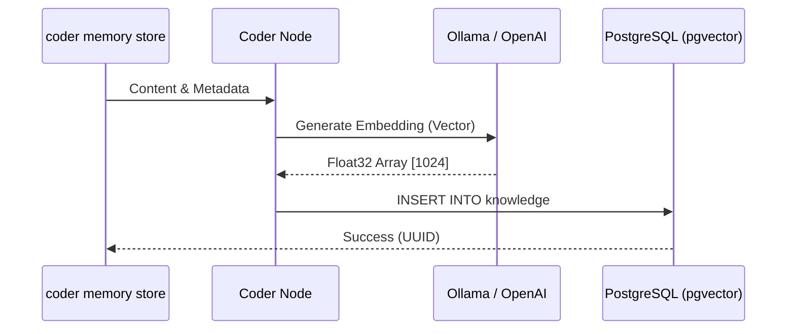

# 💾 Semantic Memory System

The **Semantic Memory System** allows AI agents to maintain a long-term "memory" across project iterations and even across different projects. It serves as a **Cognitive Memory Framework** tailored for autonomous agents and automated workflows.

## 🌟 Concept

Unlike "Skills" (which are general best practices), **Memory** stores:

- **Project Context**: Architectural decisions made for _this_ specific app.
- **Problem Solving**: "We fixed the P2P timeout by increasing the ICE candidate buffer."
- **Institutional Knowledge**: "The API key for the staging environment is managed in Vault, not `.env`."

---

## 🧱 Data Model

Each record ([Knowledge](../internal/domain/memory/entity.go)) is an augmented data point:

### 1. Classification (`Type`)

- **`fact`**: Objective truths (e.g., "System is running on C++14").
- **`rule`**: Mandatory coding standards or constraints.
- **`decision`**: ADRs (Architecture Decision Records) and their rationale.
- **`pattern`**: Reusable code or logic structures discovered during dev.
- **`event`**: Incidents, migrations, bugs, or one-time operational learnings.
- **`document`**: Traditional text/documentation (Default).

Legacy types such as `preference` and `skill` may still exist in historical data, but new lifecycle-aware memory flows should prefer the canonical types above.

### 2. Ecological Identity (`Metadata`)

Utilizes PostgreSQL `JSONB` for deep filtering:

- **`entity_id`**: Identifies which project/team this memory belongs to.
- **`session_id`**: Scope for short-term memory (session-based).
- **`process_id`**: The agent/service that generated the memory.
- **`status`**: Lifecycle state (`active`, `superseded`, `expired`, `archived`, `draft`).
- **`canonical_key`**: Stable key connecting multiple versions of the same memory.
- **`valid_from` / `valid_to`**: Optional validity window for time-sensitive memories.
- **`last_verified_at`**: Timestamp of the most recent verification.
- **`supersedes_id` / `superseded_by_id`**: Version chain pointers.

Phase 2 promotes the main lifecycle fields into first-class PostgreSQL columns (`status`, `canonical_key`, `supersedes_id`, `superseded_by_id`, `valid_from`, `valid_to`, `last_verified_at`, `confidence`, `source_ref`, `verified_by`) while keeping metadata mirrored for transport compatibility. Phase 3 adds conflict-aware retrieval plus manual lifecycle maintenance commands (`verify`, `supersede`, `audit`).

---

## 🏗️ Technical Architecture

### 🛡️ Technology Stack

- **Persistence**: PostgreSQL with `pgvector` extension.
- **Search**: Hybrid search (pgvector + full-text search) with lifecycle column filters and freshness-aware reranking.
- **Embeddings**: Generated via **Ollama** (`mxbai-embed-large`) or OpenAI.

### A. Storage Flow (Memorizing)



### B. Search Flow (Retrieval)


---

## 🔄 Lifecycle Management

Memory lifecycle is metadata-first in the current implementation:

- New memories default to `status=active`.
- `coder memory store --replace-active` supersedes the currently active memory with the same canonical key.
- `coder memory search` is active-only by default unless `--include-stale` is provided.
- `coder memory search --as-of <time>` evaluates validity at a specific point in time.
- `coder memory search` returns a synthesized conflict summary when multiple active versions for the same canonical key disagree; use `--history` to inspect raw versions.
- `coder memory verify` refreshes verification metadata across a memory version group.
- `coder memory supersede` links two version groups and updates their lifecycle states atomically at the repository layer.
- `coder memory audit` reports active conflicts, expired-but-active memories, long-unverified active memories, and records missing lifecycle columns.
- PostgreSQL backfills lifecycle columns from legacy metadata during initialization so lifecycle filters use real columns on the hot path.

The system includes a **Compaction** command:
`coder memory compact`

This process:

- Identifies duplicate or redundant entries.
- Summarizes multiple related memories into a single, high-level entry.
- Cleans up stale or low-utility information.

For the detailed implementation plan to prevent stale or superseded memories from surfacing in default retrieval, see [Memory Lifecycle Plan](memory_lifecycle_plan.md).

### Active Recall State

To support re-entrant retrieval during long tasks, the CLI maintains a local active recall snapshot in `.coder/active-memory.json`.

The file is refreshed on successful `coder memory search` runs and represents the memory context the agent most recently recalled.
`coder memory recall` also updates the same file, but with additional decision metadata such as `keep`, `add`, `drop`, `coverage`, and `conflicts`.

Current fields:

- `query`: last memory query string
- `scope`: last scope filter
- `type`: last memory type filter
- `limit`: result budget used for the last search
- `status`: lifecycle status filter, if any
- `canonical_key`: canonical key filter, if any
- `as_of`: time-travel search point, if any
- `include_stale`: whether stale history was allowed
- `history`: whether multi-version history mode was enabled
- `searched_at`: timestamp of the recall
- `results`: currently active recalled memory items

Each result stores:

- `id`
- `title`
- `type`
- `scope`
- `status`
- `canonical_key`
- `score`
- `tags`
- `last_verified_at`
- `conflict_detected`
- `conflict_count`
- `content`

This state is intentionally local-first, mirroring `.coder/active-skills.json`. It is designed for inspectability and recovery, not as hidden background memory.

The corresponding inspection command is:

```bash
coder memory active
coder memory active --format json
```

This command does not perform a new search. It only reports the last active recall state so an agent or operator can understand what memory context was loaded most recently.

For decision-based refresh during long tasks, use:

```bash
coder memory recall "<task>" --trigger execution --budget 5
```

This re-queries memory, compares the new result set with the current active-memory state, and records which items should be kept, added, or dropped.

---

## 🚪 Integration: Gate 2

In the [3-Gate System](architecture.md#agent-reasoning), agents query the memory immediately after fetching skills. This ensures they don't repeat past mistakes and follow established project patterns exactly as they were implemented previously.
