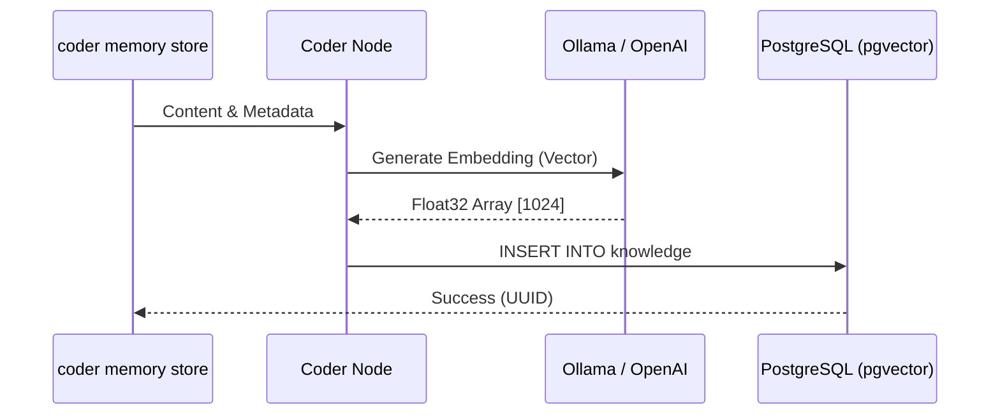
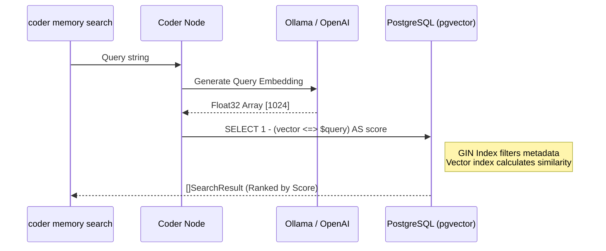

# 💾 Semantic Memory System

The **Semantic Memory System** allows AI agents to maintain a long-term "memory" across project iterations and even across different projects. It serves as a **Cognitive Memory Framework** tailored for autonomous agents and automated workflows.

## 🌟 Concept

Unlike "Skills" (which are general best practices), **Memory** stores:
- **Project Context**: Architectural decisions made for *this* specific app.
- **Problem Solving**: "We fixed the P2P timeout by increasing the ICE candidate buffer."
- **Institutional Knowledge**: "The API key for the staging environment is managed in Vault, not `.env`."

---

## 🧱 Data Model

Each record ([Knowledge](../internal/memory/model.go)) is an augmented data point:

### 1. Classification (`Type`)
- **`fact`**: Objective truths (e.g., "System is running on C++14").
- **`rule`**: Mandatory coding standards or constraints.
- **`decision`**: ADRs (Architecture Decision Records) and their rationale.
- **`pattern`**: Reusable code or logic structures discovered during dev.
- **`document`**: Traditional text/documentation (Default).

### 2. Ecological Identity (`Metadata`)
Utilizes PostgreSQL `JSONB` for deep filtering:
- **`entity_id`**: Identifies which project/team this memory belongs to.
- **`session_id`**: Scope for short-term memory (session-based).
- **`process_id`**: The agent/service that generated the memory.

---

## 🏗️ Technical Architecture

### 🛡️ Technology Stack
- **Persistence**: PostgreSQL with `pgvector` extension.
- **Search**: Hybrid search (Metadata GIN index + Vector Cosine Similarity `<=>`).
- **Embeddings**: Generated via **Ollama** (`mxbai-embed-large`) or OpenAI.

### A. Storage Flow (Memorizing)

### B. Search Flow (Retrieval)

---

## 🔄 Lifecycle Management

The system includes a **Compaction** command:
`coder memory compact`

This process:
- Identifies duplicate or redundant entries.
- Summarizes multiple related memories into a single, high-level entry.
- Cleans up stale or low-utility information.

---

## 🚪 Integration: Gate 2

In the [3-Gate System](architecture.md#agent-reasoning), agents query the memory immediately after fetching skills. This ensures they don't repeat past mistakes and follow established project patterns exactly as they were implemented previously.
